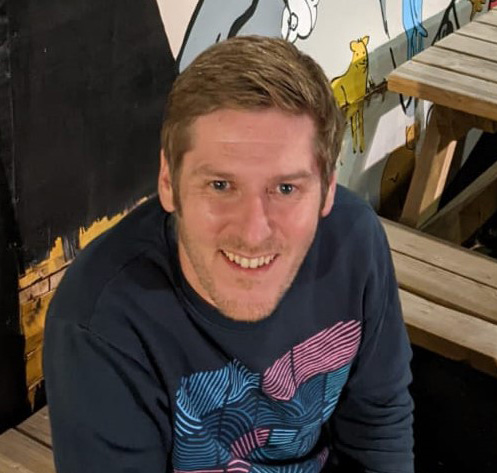

::: {.column-page}

::: {.grid}

::: {.g-col-12 .g-col-md-8}

## Welcome

I'm a Training and Communications Manager at the [Archaeology Data Service](https://archaeologydataservice.ac.uk/) and [Heritage Science Data Service](https://heritagesciencedataservice.ac.uk/) at the University of York, where I lead strategic development of training programmes and communications for digital heritage communities.

My work sits at the intersection of **archaeology**, **data science**, and **research training**. I combine expertise in spatial analysis, research data management, and digital methods with a passion for teaching researchers sustainable, reproducible research practices.

:::

::: {.g-col-12 .g-col-md-4}

{.profile-img width="100%"}

:::

:::

## What I Do

::: {.grid}

::: {.g-col-12 .g-col-md-4}
### 🏛️ Heritage & Archaeology
Research in European Iron Age and Roman archaeology using geospatial statistics, databases, and digital methods. Focus on landscape transformation, settlement patterns, and linear earthwork systems.
:::

::: {.g-col-12 .g-col-md-4}
### 📊 Data Science & Research
Expertise in R programming, PostgreSQL/PostGIS, geospatial analysis (QGIS, ArcGIS), and research data management. Committed to FAIR data principles and Open Science practices.
:::

::: {.g-col-12 .g-col-md-4}
### 👩‍🏫 Training & Teaching
Certified [Carpentries](https://carpentries.org/) instructor teaching researchers digital skills. Design and deliver training on data management, programming, and reproducible research methods.
:::

:::

## Current Focus

- Leading training strategy for the Archaeology Data Service and Heritage Science Data Service
- Teaching researchers computational skills through The Carpentries
- Developing research data infrastructure and training portals
- Contributing to EU-funded research projects (ATRIUM, ECHOES, ARTEMIS)
- Promoting Open Science and FAIR data principles in heritage sectors

## Get in Touch

I'm available for:

- **Consulting**: Research data management, digital heritage infrastructure
- **Training**: Workshops on R, Python, GIS, reproducible research
- **Collaboration**: Digital archaeology projects, open science initiatives
- **Speaking**: Conferences, seminars, webinars on data science in heritage

[ Email me](mailto:nickyjgarland@gmail.com) | 
[ GitHub](https://github.com/nickyjgarland) | 
[ ORCID](https://orcid.org/0000-0002-6789-0779) | 
[ Google Scholar](https://scholar.google.co.uk/citations?user=jreSyccAAAAJ&hl=en)

:::
